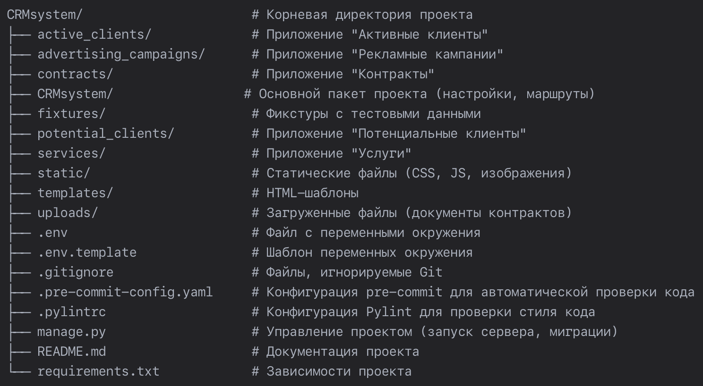

# 📊 CRM System — Система управления взаимоотношениями с клиентами

### CRM-система в виде Django-приложения для работы с потенциальными и активными клиентами, отслеживания рекламных кампаний и управления контрактами


## ⚙️ Требования к системе

- **Бэкенд**
    - Python 3.9+
    - Django 4.2+
    - PostgreSQL (база данных)
    - psycopg2 (драйвер PostgreSQL)

- **Фронтенд** - HTML-шаблоны и CSS-стили предоставлены в рамках ТЗ

- **Инструменты разработки**
    - Pylint + pylint-django (статический анализ кода)
    - pre-commit (автоматическая проверка кода перед коммитом)

## 📋 Основной функционал приложения:
- Авторизация пользователя; 
- Создание, редактирование и просмотр предоставляемых услуг;
- Создание, редактирование и просмотр рекламной кампании;
- Создание, редактирование и просмотр потенциальных клиентов;
- Создание, редактирование и просмотр контракта для клиента;
- Перевод потенциального клиента в активного;
- Подсчёт и отображение статистики по рекламным кампаниям: сколько привлечено потенциальных клиентов, сколько из них перешло в активных.

## 👥 Роли пользователей:
- **Администратор**: Полный доступ ко всем разделам, управление пользователями и ролями через админку Django
- **Оператор**: Создание, просмотр и редактирование потенциальных клиентов (лидов)
- **Маркетолог**: Создание, просмотр и редактирование услуг и рекламных кампаний
- **Менеджер**: Создание, просмотр и редактирование контрактов; просмотр лидов и перевод их в активных клиентов
- Всем ролям доступен просмотр статистики рекламных кампаний

## 📂 Структура проекта


## ⚡ Установка и запуск
````
1. Клонировать репозиторий:
    git clone git@github.com:skurkova/CRMsystem.git
    cd CRMsystеm

2. Создать и активировать виртуальное окружение:
    python3 -m venv venv
    source venv/bin/activate

3. Установить зависимости:
    pip install -r requirements.txt

4. Настроить переменные окружения:
    - переименовать файл .env.template → .env:
        cp .env.template .env
    - отредактировать файл.env:
        nano .env
        DB_NAME=<имя базы данных>
        DB_USER=<имя пользователя>
        DB_PASSWORD=<пароль>

5. Настроить базу данных PostgreSQL:
    - Установить PostgreSQL (если не установлен):
        brew install postgresql
        brew services start postgresql
    
    - Создать пользователя и базу данных:
        psql postgres 
        CREATE USER <имя пользователя> WITH PASSWORD '<пароль>' CREATEDB;
        CREATE DATABASE <имя базы данных> OWNER <имя пользователя>;
   
    - Настроить CRMsystеm/settings.py:
        from dotenv import load_dotenv
        import os
        load_dotenv()
        DATABASES = {
            'default': {
                'ENGINE': 'django.db.backends.postgresql',
                'NAME': os.getenv('DB_NAME'),
                'USER': os.getenv('DB_USER'),
                'PASSWORD': os.getenv('DB_PASSWORD'),
                'HOST': 'localhost',
                'PORT': '5433',
            }
        }

6. Применить миграции:
    python manage.py migrate

7. Запустить сервер:
    python manage.py runserver

8. Создать роли пользователей:
    python manage.py create_user_groups_permissions

9. Загрузить фикстуры в правильном порядке:
    python manage.py loaddata fixtures/services.json
    python manage.py loaddata fixtures/advertising_campaigns.json
    python manage.py loaddata fixtures/potential_clients.json
    python manage.py loaddata fixtures/contracts.json
    python manage.py loaddata fixtures/active_clients.json
    python manage.py loaddata fixtures/users.json

10. Открыть в браузере:
    - Основной интерфейс: http://127.0.0.1:8000/
    - Админка Django: http://127.0.0.1:8000/admin/
````

## 🔍 Проверка качества кода
- **Ручная проверка стиля кода**
````
pylint --load-plugins pylint_django --django-settings-module=CRMsystеm.settings .
````
- **Автоматическая проверка стиля кода**
````
pre-commit install
````
После установки **pre-commit** проверка запускается автоматически при каждом коммите
